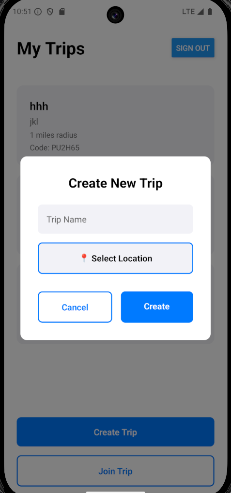
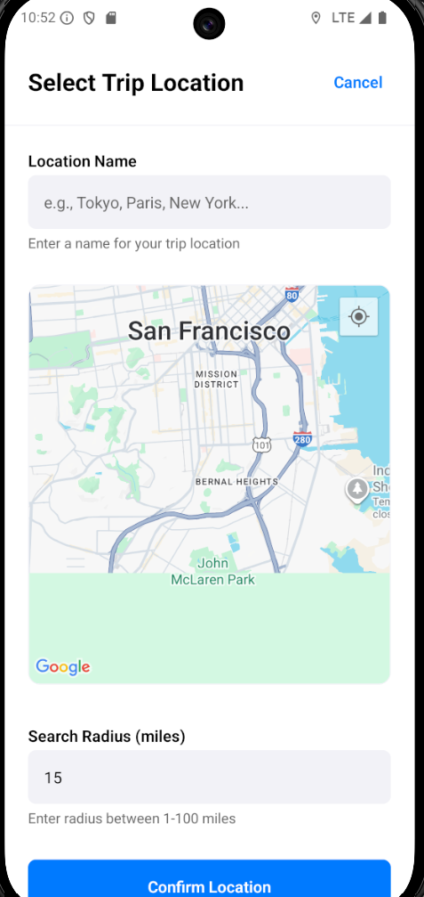
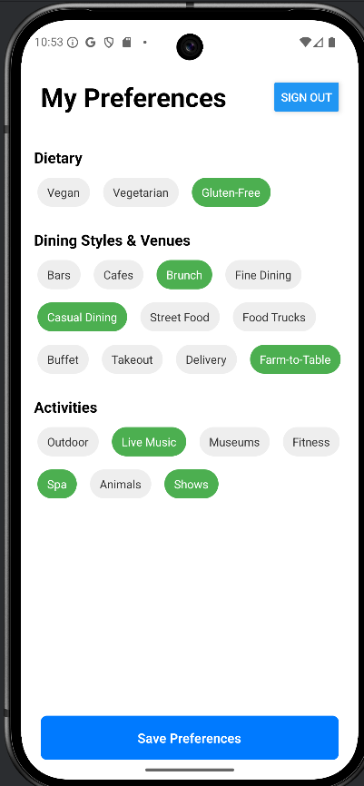
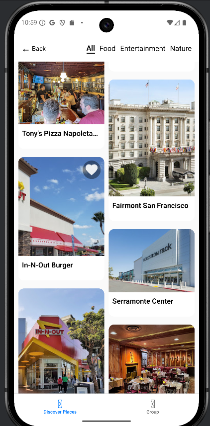

# Mosaic

Mosaic is a mobile group travel planner app that allows group of friends to plan out their next trip. Mosaic utilizies a custom built recommendation system along with a friendly mobile app UI to allow users to plan their next trip with a few clicks.

Mosaic is built with React Native on the frontend, with tools such as Elastic Search, Supabase, and Flask powering the backend.

## 🚀 Features 🚀

- Custom feed of locations/places to visit based off user preferences
- Authentication via Google to allow for easy sign up
- Easy trip planning via Google Maps API to allow groups to easily input their travel destination
- Everything bundled in one easy to use mobile app 🔥

## ⚡️ Tech Stack ⚡️

- React Native
- TypeScript
- Flask
- Python
- ElasticSearch (Vector DB)
- Supabase
- Google APIS (Google places, Google Auth)

## 🏃 Setup and Run Locally 🏃

To run the project locally, follow these steps:

### Prerequisites

- Ensure you have the following installed:
  - [Node.js](https://nodejs.org/) (v16 or later)
  - [npm](https://www.npmjs.com/) or [yarn](https://yarnpkg.com/)
  - [Python](https://www.python.org/) (v3.9 or later)
  - [pip](https://pip.pypa.io/en/stable/)
  - [Expo CLI](https://docs.expo.dev/get-started/installation/)

### 1. Clone the Repository

```bash
git clone https://github.com/purelyKai/Mosaic.git
cd Mosaic
```

### 2. Set Up Environment Variables

#### Backend

- Copy the `.env.example` file to create a `.env` file in the `backend` directory:

```bash
cp backend/.env.example backend/.env
```

- Fill in the required values in the `backend/.env` file:
  - `ELASTIC_CLOUD_ID`
  - `ELASTIC_API_KEY`
  - `PLACES_API_KEY`
  - `OPENAI_API_KEY`
  - `HOST_IP`
  - `HOST_PORT`

#### Frontend

- Copy the `.env.example` file to create a `.env` file in the `mobile` directory:

```bash
cp mobile/.env.example mobile/.env
```

- Fill in the required values in the `mobile/.env` file:
  - `EXPO_PUBLIC_SUPABASE_URL`
  - `EXPO_PUBLIC_SUPABASE_ANON_KEY`
  - `EXPO_PUBLIC_GOOGLE_WEB_CLIENT_ID`
  - `EXPO_PUBLIC_API_BASE_URL`

### 3. Install Dependencies

#### Backend

```bash
cd backend
pip install -r requirements.txt
```

#### Mobile

```bash
cd ../mobile
npm install
```

### 4. Configure Elasticsearch Properties

- Ensure the Elasticsearch properties are set up correctly. Refer to the `elasticsearch_properties_example.txt` file in the `backend` directory for the required mappings:

```plaintext
{
  "mappings": {
    "properties": {
      "doc_type": {
        "type": "keyword"
      },
      "location": {
        "type": "geo_point"
      },
      "place_id": {
        "type": "keyword"
      },
      "place_name": {
        "type": "text"
      },
      "place_summary_text": {
        "type": "text"
      },
      "place_vec": {
        "type": "dense_vector",
        "dims": 512,
        "index": true,
        "similarity": "cosine",
        "index_options": {
          "type": "bbq_hnsw",
          "m": 16,
          "ef_construction": 100,
          "rescore_vector": {
            "oversample": 3
          }
        }
      },
      "user_uuid": {
        "type": "keyword"
      },
      "user_vec": {
        "type": "dense_vector",
        "dims": 512,
        "index": true,
        "similarity": "cosine",
        "index_options": {
          "type": "bbq_hnsw",
          "m": 16,
          "ef_construction": 100,
          "rescore_vector": {
            "oversample": 3
          }
        }
      },
      "view_count": {
        "type": "integer"
      }
    }
  }
}
```

### 5. Run the Applications

#### Backend

- Start the Flask server:

```bash
cd backend
python app.py
```

#### Mobile

- Start the Expo development server:

```bash
cd ../mobile
npx expo start
```

### 6. Access the Applications

- Backend: The Flask server will run at `http://127.0.0.1:5000` by default.
- Mobile: Use the Expo Go app or an emulator to preview the app.

### Required APIs

The following APIs are required to run the project:

- **Elasticsearch**: For storing vectors containing information about users and locations.
- **Google Places API**: For fetching place details.
- **OpenAI API**: For generating vectors to store user preferences and other AI-driven features.
- **Supabase**: For authentication and database management.

## 📸 Project Images 📸

Here are some images showcasing the Mosaic project:







## 📄 License 📄 ##
This project is supported by the [MIT License](https://opensource.org/license/MIT).